# LLM Architecture Documentation

This document provides a comprehensive explanation of the Language Model architecture with detailed diagrams and educational notes.

## Table of Contents
1. [Overview](#overview)
2. [Complete Architecture](#complete-architecture)
3. [Component Details](#component-details)
4. [Data Flow](#data-flow)
5. [Training Process](#training-process)
6. [Inference Process](#inference-process)

---

## Overview

### What is a Language Model?

A Language Model (LM) is a neural network that learns to predict the next token in a sequence. Given a sequence of tokens, it assigns probabilities to possible next tokens.

**Educational Intuition:**
```
Input:  "The cat sat on the ___"
Model predicts: [mat: 0.85, chair: 0.10, floor: 0.05, ...]
```

### Architecture Style: LLaMA-inspired

Our implementation follows the LLaMA (Large Language Model Meta AI) architecture, which is a modern transformer-based design.

**Key Components:**
- Rotary Position Embeddings (RoPE)
- RMS Layer Normalization
- Multi-Head Attention with Causal Masking
- SwiGLU Feed-Forward Networks
- Tied Embeddings

---

## Complete Architecture

### High-Level Diagram

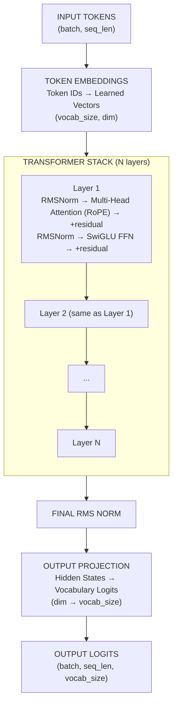

### Model Size Comparison

| Config | Params | Layers | Dim | Heads | VRAM Needed |
|--------|--------|--------|-----|-------|-------------|
| pico   | ~1M    | 4      | 64  | 4     | < 1GB       |
| nano   | ~3M    | 6      | 128 | 8     | ~1GB        |
| micro  | ~6M    | 8      | 192 | 12    | ~2GB        |
| tiny   | ~10M   | 6      | 256 | 8     | ~2GB        |
| small  | ~25M   | 8      | 384 | 12    | ~4GB        |
| medium | ~50M   | 12     | 512 | 16    | ~6GB        |
| large  | ~100M  | 16     | 640 | 20    | ~8GB        |

---

## Component Details

### 1. Token Embeddings

**Purpose:** Convert discrete token IDs to continuous vectors.

> **Paper:** Press & Wolf, *Using the Output Embedding to Improve Language Models* (2016) — https://arxiv.org/abs/1608.05859

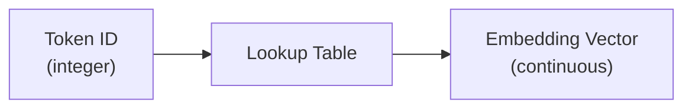

Example: Token `"hello"` (ID: 1234) &rarr; `[0.2, -0.5, 0.8, ..., 0.1]` (a dim-dimensional vector).

**Architecture:**
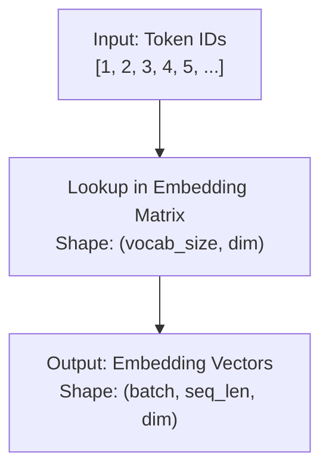

**Tied Embeddings:**
- Input embeddings and output projection share weights
- Saves parameters: vocab_size × dim
- No loss in quality for language models

### 2. Rotary Position Embeddings (RoPE)

**Purpose:** Encode position information in token embeddings through rotation.

> **Paper:** Su et al., *RoFormer: Enhanced Transformer with Rotary Position Embedding* (2021) — https://arxiv.org/abs/2104.09864

**Why RoPE?**
- Traditional: Add position embeddings to token embeddings
- RoPE: Rotate embeddings based on position (more elegant)
- Captures relative positions naturally

**Mathematical Intuition:**
```
For token at position m:
  θ(m, i) = m / (base ^ (2i / dim))
  
  Rotate embedding pair (x_2i, x_2i+1) by angle θ(m, i):
    [x'_2i  ]   [cos(θ)  -sin(θ)]   [x_2i  ]
    [       ] = [                ] × [       ]
    [x'_2i+1]   [sin(θ)   cos(θ)]   [x_2i+1]
```

**Diagram:**
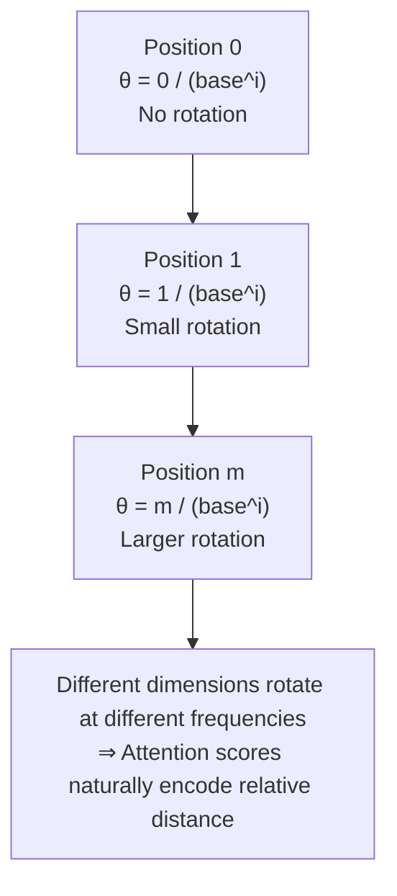

### 3. Multi-Head Attention

**Purpose:** Allow model to focus on different parts of the input sequence simultaneously.

> **Paper:** Vaswani et al., *Attention Is All You Need* (2017) — https://arxiv.org/abs/1706.03762

**Key Concepts:**
- **Query (Q):** What this position is looking for
- **Key (K):** What other positions are offering  
- **Value (V):** The actual information at each position
- **Score:** Q × K^T (how well Query matches each Key)

**Architecture Diagram:**
```mermaid
flowchart TD
    IN["Input: (batch, seq_len, dim)"]
    QKV["QKV Projection: (dim &rarr; 3 &times; dim)<br/>single matrix multiply for efficiency"]
    SPLIT["Split into Q, K, V<br/>(each: batch, seq, dim)"]
    RESHAPE["Reshape for Multi-Head<br/>(batch, seq, num_heads, head_dim)<br/>e.g. dim=512, num_heads=8, head_dim=64"]
    ROPE["Apply RoPE to Q and K<br/>(position-aware rotation)"]
    SCORES["Compute Attention Scores<br/>Scores = Q &times; K&#7488; / sqrt(head_dim)<br/>(batch, num_heads, seq_len, seq_len)"]
    MASK["Apply Causal Mask<br/>Prevents attending to future positions"]
    SOFT["Softmax &rarr; Attention Weights<br/>(probabilities sum to 1)"]
    WSUM["Weighted Sum of Values<br/>Output = Weights &times; V<br/>(batch, num_heads, seq_len, head_dim)"]
    CONCAT["Concatenate Heads<br/>(batch, seq_len, dim)"]
    OUTPROJ["Output Projection<br/>(dim &rarr; dim)"]
    OUT["Output: (batch, seq_len, dim)"]

    IN --> QKV --> SPLIT --> RESHAPE --> ROPE --> SCORES --> MASK --> SOFT --> WSUM --> CONCAT --> OUTPROJ --> OUT
```

**Causal Mask** ensures each position only sees itself and earlier positions:

| Position | Visible positions |
|----------|-------------------|
| 0        | can see 0         |
| 1        | can see 0, 1      |
| 2        | can see 0, 1, 2   |

**Why Multiple Heads?**
- Each head learns different relationship types
- Head 1 might learn syntax
- Head 2 might learn semantics
- Head 3 might learn long-range dependencies
- Ensemble effect improves capacity

### 4. Feed-Forward Network (SwiGLU)

**Purpose:** Add non-linearity and computational capacity after attention.

> **Paper:** Shazeer, *GLU Variants Improve Transformer* (2020) — https://arxiv.org/abs/2002.05202

**SwiGLU Activation:**
```
SwiGLU(x) = Swish(x) ⊙ (xW_g)

Where:
  Swish(x) = x × sigmoid(x)
  ⊙ = element-wise multiply
  W_g = gate projection

Standard FFN: Linear → ReLU → Linear
SwiGLU FFN: Linear → (SwiGLU gate) → Linear
```

**Diagram:**
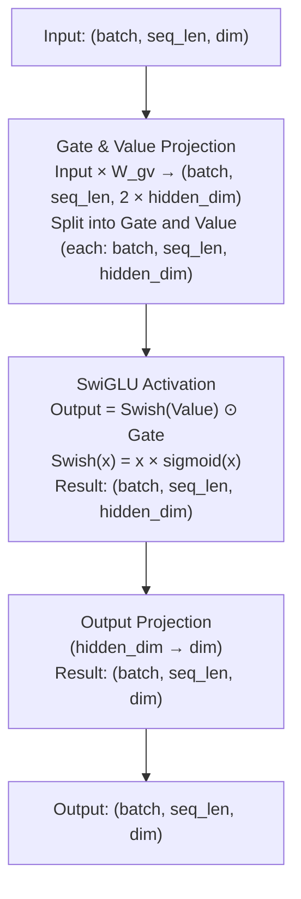

### 5. Transformer Block

**Complete Block with Residual Connections:**

> **Papers:**
> - Vaswani et al., *Attention Is All You Need* (2017) — https://arxiv.org/abs/1706.03762 (original block, post-norm)
> - Touvron et al., *LLaMA* (2023) — https://arxiv.org/abs/2302.13971 (pre-norm with RMSNorm; Zhang & Sennrich, *RMSNorm* (2019) — https://arxiv.org/abs/1910.07467)

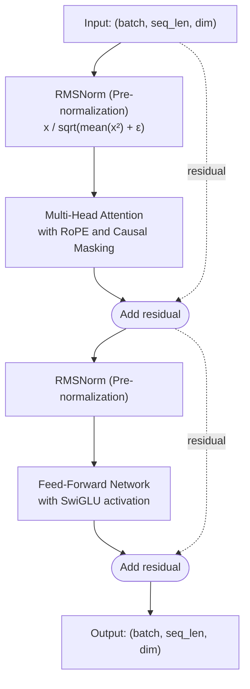

**Pre-Normalization vs Post-Normalization:**

**Pre-Norm (Modern, LLaMA):**
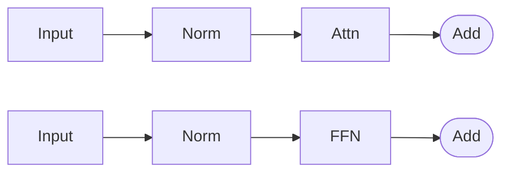

**Post-Norm (Original Transformer):**
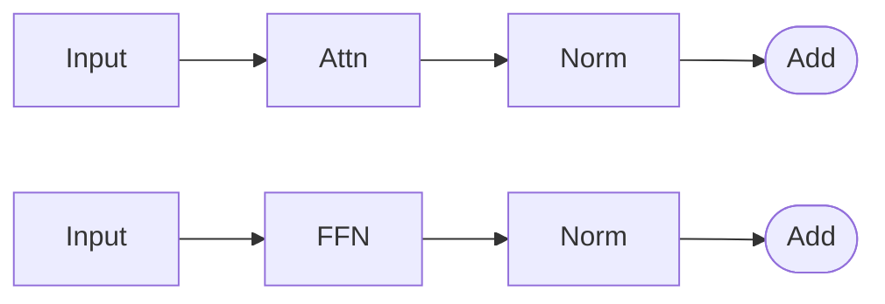

| Benefits of Pre-Norm | Benefits of Post-Norm |
|----------------------|-----------------------|
| More stable training | Simpler gradient flow  |
| Better for deep networks | Original formulation |
| Used in modern LLMs  | Transformers, BERT    |

---

## Data Flow

### Training Data Flow

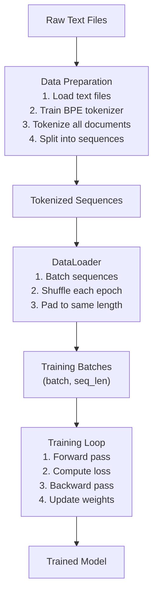

### Forward Pass Data Flow

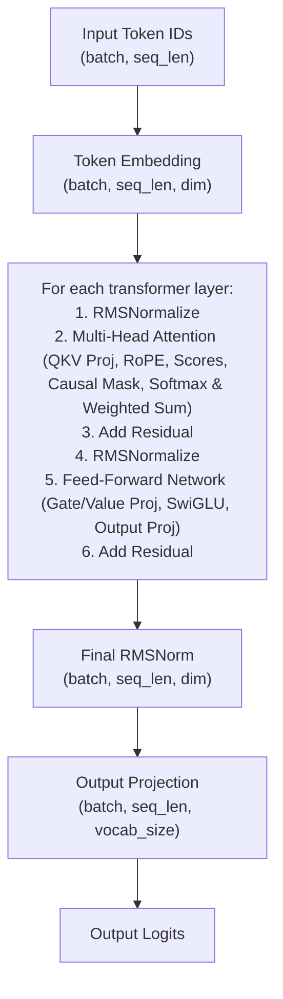

---

## Training Process

### Training Loop Diagram

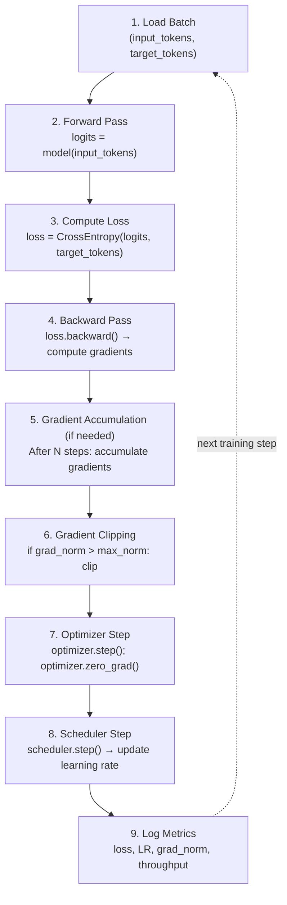

### Loss Computation

**Inputs:** `logits: (batch, seq_len, vocab_size)`, `targets: (batch, seq_len)`

**Next Token Prediction Setup:**
- Input:  `[BOS, "The", "cat", "sat"]`
- Target: `["The", "cat", "sat", "on"]`
- Model learns: `P(target | input)`

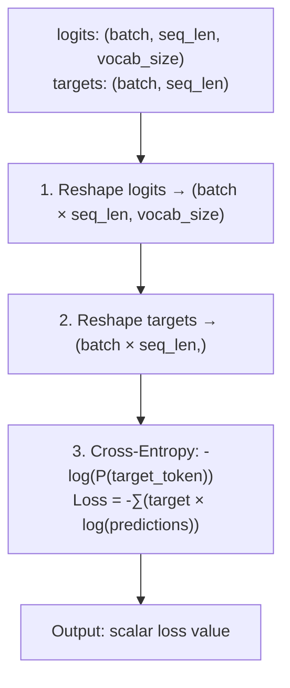

### Learning Rate Schedule

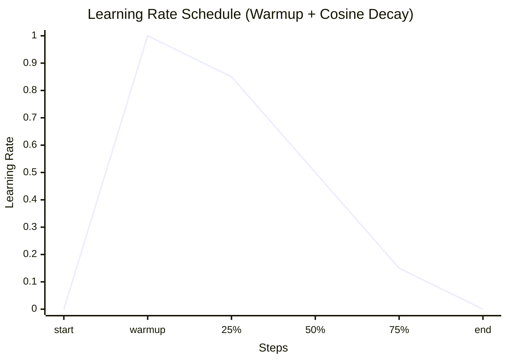

- **Warmup:** Linear increase to peak LR (the first step already uses a
  non-zero LR of `peak / warmup_steps`, so no update is wasted at LR 0)
- **Decay:** Cosine decrease from peak to min LR

---

## Inference Process

### Text Generation Flow

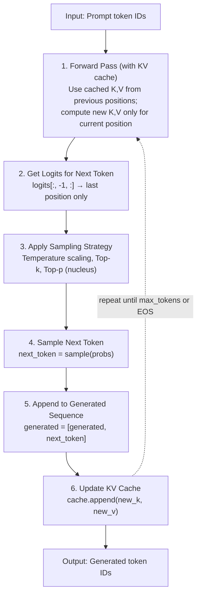

### KV Cache Diagram

**Without KV Cache (Slow):** each new token reprocesses all previous positions.

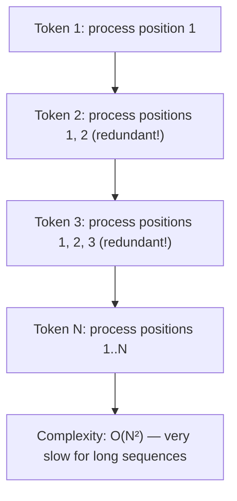

**With KV Cache (Fast):** each new token only processes its own position and reuses cached K,V.

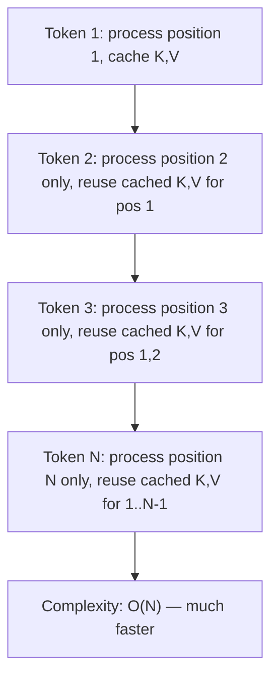

**Cache Structure:**

```mermaid
flowchart TD
    subgraph L1["Layer 1 Cache"]
        K1["Key Cache:   [K&#8321;, K&#8322;, K&#8323;, ..., K&#8345;]"]
        V1["Value Cache: [V&#8321;, V&#8322;, V&#8323;, ..., V&#8345;]<br/>(accumulated from positions 1 to n)"]
    end
    L2["Layer 2 Cache (same structure)"]
    LN["Layer N Cache (same structure)"]
    L1 --> L2 --> LN
```

### Sampling Strategies

**1. Greedy Decoding (Deterministic):** always pick the most likely token.

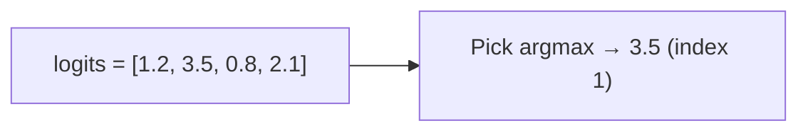

- Pros: Deterministic, focused output
- Cons: Can be repetitive, limited diversity

**2. Temperature Sampling:** scale logits by temperature before softmax.

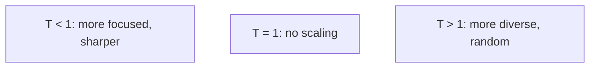

Example: `T = 0.7` &rarr; `logits = [1.2, 3.5, 0.8, 2.1] / 0.7` &rarr; more extreme differences.

**3. Top-k Sampling:** sample from the top `k` tokens only.

```mermaid
flowchart LR
    A["All logits"] --> B["Keep top k (e.g. k=50)<br/>mask the rest"] --> C["Sample<br/>(prevents unlikely tokens)"]
```

**4. Top-p (Nucleus) Sampling:** sample from the smallest set whose cumulative probability &ge; `p`.

```mermaid
flowchart LR
    A["Sorted probabilities"] --> B["Keep tokens until cumulative prob = p<br/>(e.g. p=0.9 &rarr; top 90% mass)"] --> C["Sample<br/>(more adaptive than top-k)"]
```

---

## Summary

### Key Takeaways

1. **Architecture Components:**
   - Token Embeddings: Discrete → Continuous
   - RoPE: Position encoding through rotation
   - Multi-Head Attention: Focus on different relationships
   - SwiGLU FFN: Non-linearity and capacity
   - Transformer Blocks: Stack attention + FFN

2. **Training Process:**
   - Forward pass: Compute predictions
   - Loss: Measure prediction error
   - Backward pass: Compute gradients
   - Optimizer: Update weights
   - Scheduler: Adjust learning rate

3. **Inference Process:**
   - Autoregressive generation
   - KV cache: Speed up computation
   - Sampling strategies: Control diversity

4. **Educational Design:**
   - Modular: Each component independently testable
   - Documented: Extensive comments explaining concepts
   - Scalable: Multiple model sizes (1M to 100M parameters)
   - Practical: Works on consumer hardware

### Model Size Selection Guide

| Purpose | Recommended Config | Reason |
|---------|-------------------|---------|
| Quick test | pico (1M) | Fastest verification |
| CPU training | nano (3M) | Fits in memory |
| Experimentation | micro (6M) | Fast iteration |
| Debugging | tiny (10M) | Test architecture changes |
| Production | small (25M) | Balance quality & speed |
| Realistic | medium (50M) | Demonstrate scaling |
| Maximum | large (100M) | Upper limit for 6GB VRAM |

---

## Further Reading

Primary sources for the concepts above (see the
[README References](../README.md#references) for the full annotated list):

- Transformer / attention — [Attention Is All You Need](https://arxiv.org/abs/1706.03762)
- LLaMA design (pre-norm, RoPE, SwiGLU, RMSNorm) — [LLaMA](https://arxiv.org/abs/2302.13971)
- RoPE — [RoFormer](https://arxiv.org/abs/2104.09864)
- RMSNorm — [Root Mean Square Layer Normalization](https://arxiv.org/abs/1910.07467)
- SwiGLU — [GLU Variants Improve Transformer](https://arxiv.org/abs/2002.05202)
- BPE tokenization — [Neural Machine Translation of Rare Words with Subword Units](https://arxiv.org/abs/1508.07909)
- Nucleus (top-p) sampling — [The Curious Case of Neural Text Degeneration](https://arxiv.org/abs/1904.09751)

**For more details, see:**
- [Training Guide](training_guide.md) - How to train the model
- [Inference Guide](inference_guide.md) - How to use for generation
- [Source Code](../src/) - Implementation with extensive comments
