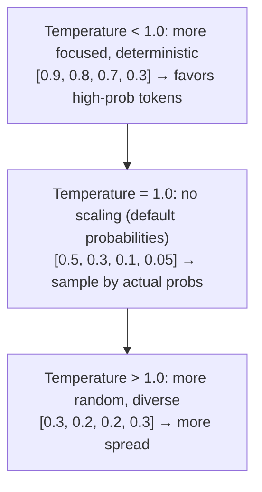
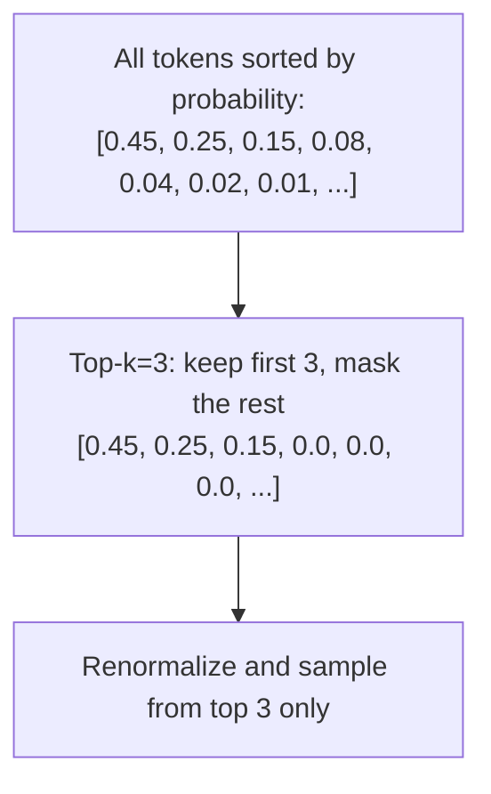
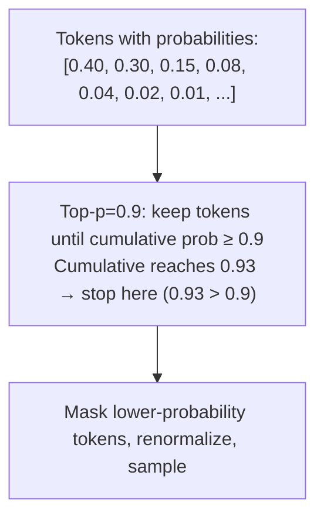

# Inference Guide

This guide explains how to use the trained Athena model for text generation, with detailed examples and explanations.

## Table of Contents
1. [Loading a Trained Model](#loading-a-trained-model)
2. [Text Generation Methods](#text-generation-methods)
3. [Sampling Strategies](#sampling-strategies)
4. [Interactive Generation](#interactive-generation)
5. [Batch Generation](#batch-generation)
6. [Optimization Tips](#optimization-tips)

---

## Loading a Trained Model

### Step 1: Locate Checkpoint

Find your trained model checkpoint:

```bash
ls -lh data/checkpoints/

# Example output:
# best.pt         (best model so far - lowest tracked loss)
# checkpoint_step_5000.pt
# checkpoint_step_10000.pt
# ...
```

Both kinds of files are always written: every `--checkpoint-every` interval
produces a `checkpoint_step_N.pt` (used by `load_latest()` to resume), and
`best.pt` is additionally updated whenever the tracked loss improves.

### Step 2: Load Model

```python
import torch
from src.model.llm import LLM
from src.config.model_config import get_config
from src.utils.device import get_device

# Load configuration (should match trained model)
config = get_config("small")

# Create model
model = LLM(config)

# Get device
device = get_device()
model = model.to(device)

# Load checkpoint weights
# weights_only=False because the checkpoint also stores the ModelConfig object
checkpoint = torch.load("data/checkpoints/best.pt", map_location="cpu", weights_only=False)
model.load_state_dict(checkpoint["model_state_dict"])

print(f"Model loaded successfully")
print(f"Training step: {checkpoint['step']}")
print(f"Loss: {checkpoint['loss']:.4f}")
```

**Output:**
```
Model loaded successfully
Training step: 50000
Loss: 2.3456
```

### Step 3: Set to Evaluation Mode

```python
model.eval()
```

**Why eval mode?**
- Disables dropout (deterministic output)
- BatchNorm uses running statistics (if present)
- Required for inference

---

## Text Generation Methods

### Method 1: Using Built-in Generation

The LLM class has a built-in `generate()` method:

```python
# Prepare prompt
prompt_tokens = torch.tensor([[1, 2, 3, 4]]).to(device)

# Generate
generated = model.generate(
    prompt_tokens,
    max_new_tokens=50,
    temperature=0.8,
    top_k=50,
    top_p=0.9,
    do_sample=True,
)

print(f"Generated {len(generated[0])} tokens")
print(f"Generated shape: {generated.shape}")
```

### Method 2: Using Text Generator

For more control, use the `TextGenerator` class:

```python
from src.inference.generator import TextGenerator

# Create generator
generator = TextGenerator(
    model,
    max_sequence_length=512,
    use_kv_cache=True,  # Enable KV cache for speed
)

# Generate
outputs = generator.generate(
    prompt_tokens,
    max_tokens=100,
    temperature=0.8,
    top_k=50,
    top_p=0.9,
    do_sample=True,
)

# Decode (would need tokenizer in practice)
# For now, outputs are token IDs
print(f"Generated {len(outputs)} sequences")
```

### Method 3: Custom Generation Loop

For maximum control, implement your own loop:

```python
import torch.nn.functional as F

def generate_custom(model, prompt_tokens, max_tokens=50, temperature=0.8):
    """Custom generation loop with full control."""
    model.eval()
    
    generated = prompt_tokens.clone()
    
    with torch.no_grad():
        for _ in range(max_tokens):
            # Forward pass (only last position for efficiency)
            logits = model(generated)
            
            # Get logits for last position
            next_token_logits = logits[:, -1, :]
            
            # Apply temperature
            next_token_logits = next_token_logits / temperature
            
            # Sample next token
            probs = F.softmax(next_token_logits, dim=-1)
            next_token = torch.multinomial(probs, num_samples=1)
            
            # Append to sequence
            generated = torch.cat([generated, next_token], dim=1)
    
    return generated

# Use
output = generate_custom(model, prompt_tokens, max_tokens=50)
```

---

## Sampling Strategies

### Temperature

Controls randomness in generation:



**Examples:**
```python
# Focused generation
output = model.generate(prompt, max_new_tokens=50, temperature=0.3)

# Normal generation
output = model.generate(prompt, max_new_tokens=50, temperature=1.0)

# Diverse generation
output = model.generate(prompt, max_new_tokens=50, temperature=1.5)
```

**Recommended Values:**
- `0.7-0.9`: Focused, high-quality text
- `1.0-1.2`: Balanced (most common)
- `1.5-2.0`: Very diverse, creative

### Top-K Sampling

Limit to top k most likely tokens:



**Examples:**
```python
# Conservative (top 10 tokens)
output = model.generate(prompt, max_new_tokens=50, top_k=10)

# Balanced (top 50 tokens)
output = model.generate(prompt, max_new_tokens=50, top_k=50)

# Diverse (top 100 tokens)
output = model.generate(prompt, max_new_tokens=50, top_k=100)
```

**Recommended Values:**
- `1`: Greedy (most likely token)
- `10-40`: Conservative
- `40-100`: Balanced
- `100+`: Diverse

### Top-P (Nucleus) Sampling

Keep tokens with cumulative probability p:

> **Paper:** Holtzman et al., *The Curious Case of Neural Text Degeneration* (2019) — https://arxiv.org/abs/1904.09751



**Examples:**
```python
# Conservative (top 90%)
output = model.generate(prompt, max_new_tokens=50, top_p=0.9)

# Standard (top 95%)
output = model.generate(prompt, max_new_tokens=50, top_p=0.95)

# Diverse (top 98%)
output = model.generate(prompt, max_new_tokens=50, top_p=0.98)
```

**Recommended Values:**
- `0.9`: Conservative
- `0.95`: Standard (most common)
- `0.98`: Diverse

### Combined Strategies

Use multiple strategies together:

```python
# High-quality, focused
output = model.generate(
    prompt,
    max_new_tokens=50,
    temperature=0.7,
    top_k=50,
    top_p=0.9
)

# Diverse, creative
output = model.generate(
    prompt,
    max_new_tokens=100,
    temperature=1.2,
    top_k=100,
    top_p=0.95
)

# Deterministic (for testing)
output = model.generate(
    prompt,
    max_new_tokens=20,
    do_sample=False
)
```

---

## Interactive Generation

### Method 1: Using InteractiveCLI

```python
from src.inference.interactive import InteractiveCLI

# Create CLI
cli = InteractiveCLI(model, tokenizer)  # tokenizer needs to be implemented

# Run interactive mode
cli.run()
```

**Interactive Session:**
```
======================================================================
Interactive Text Generation
======================================================================
Enter prompts to generate text.
Special commands: /help, /params, /reset, /quit
----------------------------------------------------------------------

Prompt: Once upon a time

Generating...

Generated text:
----------------------------------------------------------------------
Once upon a time, there was a small village nestled in the mountains...
----------------------------------------------------------------------

Prompt: /params

Current Generation Parameters
----------------------------------------------------------------------
max_tokens:   100
temperature:   0.8
top_k:         50
top_p:         0.9
----------------------------------------------------------------------

Prompt: /params temperature 1.2

Set temperature = 1.2

Prompt: The meaning of life is

Generating...

Generated text:
----------------------------------------------------------------------
The meaning of life is to find happiness and purpose in our actions...
----------------------------------------------------------------------

Prompt: /quit

Exiting...
```

### Method 2: Simple Python Loop

```python
def interactive_generation(model, tokenizer, device):
    """Simple interactive generation loop."""
    model.eval()
    
    print("Enter 'quit' to exit")
    
    while True:
        # Get prompt
        prompt = input("\nYour prompt: ")
        
        if prompt.lower() == 'quit':
            break
        
        # Encode (BOS only - EOS would signal "sequence over" to the model)
        prompt_tokens = [tokenizer.vocab.bos_token_id] + tokenizer.encode(prompt)
        prompt_tokens = torch.tensor([prompt_tokens]).to(device)
        
        # Generate
        with torch.no_grad():
            output = model.generate(
                prompt_tokens,
                max_new_tokens=100,
                temperature=0.8,
                do_sample=True,
            )
        
        # Decode
        generated_text = tokenizer.decode(output[0], skip_special_tokens=True)
        
        print(f"\nGenerated:\n{generated_text}\n")
```

---

## Batch Generation

### Generate Multiple Sequences

```python
def batch_generate(model, prompts, batch_size=4, max_tokens=50):
    """Generate from multiple prompts in batch."""
    model.eval()
    
    # Tokenize all prompts (BOS only - no EOS after a prompt)
    prompt_tokens_list = [
        [tokenizer.vocab.bos_token_id] + tokenizer.encode(p)
        for p in prompts
    ]
    
    # Pad to same length
    max_len = max(len(t) for t in prompt_tokens_list)
    padded_tokens = []
    for tokens in prompt_tokens_list:
        padding = [0] * (max_len - len(tokens))
        padded_tokens.append(tokens + padding)
    
    # Stack into batch
    prompt_batch = torch.tensor(padded_tokens).to(device)
    
    # Generate
    with torch.no_grad():
        outputs = model.generate(
            prompt_batch,
            max_new_tokens=max_tokens,
            temperature=0.8,
            do_sample=True,
        )
    
    # Decode each
    generated_texts = []
    for i in range(outputs.shape[0]):
        text = tokenizer.decode(outputs[i], skip_special_tokens=True)
        generated_texts.append(text)
    
    return generated_texts

# Use
prompts = [
    "Once upon a time",
    "In a galaxy far, far away",
    "The meaning of life is",
]

generated = batch_generate(model, prompts)

for i, text in enumerate(generated):
    print(f"\nPrompt {i+1}: {prompts[i]}")
    print(f"Generated: {text}")
```

---

## Optimization Tips

### 1. Use KV Cache

KV cache dramatically speeds up generation:

> **Paper:** Vaswani et al., *Attention Is All You Need* (2017) — https://arxiv.org/abs/1706.03762
> (Section 3.2, decoder self-attention: the K,V reuse pattern that makes caching possible)

```python
# Without KV cache (slow)
generator = TextGenerator(model, use_kv_cache=False)

# With KV cache (fast - recommended)
generator = TextGenerator(model, use_kv_cache=True)
```

**Speed Comparison:**
```
Without KV cache:  O(N²) - Processes all previous tokens each step
With KV cache:    O(N)  - Processes only current token

Example for 100 tokens:
- Without cache: ~5050 forward passes (sum 1+2+...+100)
- With cache:    ~100 forward passes (1 per token)
- Speedup: ~50x!
```

### 2. Batch Size

Generate multiple sequences in parallel:

```python
# Single sequence (slow)
for prompt in prompts:
    output = model.generate(prompt, max_new_tokens=50)

# Batch generation (fast): pass a batched (num_prompts, seq_len) tensor
outputs = model.generate(batch_prompts, max_new_tokens=50)
```

### 3. Data Type

Use mixed precision for faster generation:

```python
# FP16: Faster, less memory
model = model.to(dtype=torch.float16)

# FP32: More accurate, slower
model = model.to(dtype=torch.float32)
```

### 4. Max Tokens

Limit max tokens for faster generation:

```python
# Quick test
output = model.generate(prompt, max_new_tokens=20)

# Full generation
output = model.generate(prompt, max_new_tokens=500)
```

### 5. Device

Ensure model is on GPU:

```python
device = get_device()  # auto-detects any GPU vendor (CUDA/ROCm/XPU/MPS/DirectML), else CPU
model = model.to(device)
prompt = prompt.to(device)
```

---

## Complete Examples

### Example 1: Single Generation

```python
import torch
from src.model.llm import LLM
from src.config.model_config import get_config
from src.utils.device import get_device
from src.tokenizer.bpe_tokenizer import BPETokenizer

# Load checkpoint (architecture is stored inside it during training)
checkpoint = torch.load("data/checkpoints/best.pt", weights_only=False)
config = checkpoint.get("model_config") or get_config("small")

# Build model and load weights
model = LLM(config)
model.load_state_dict(checkpoint["model_state_dict"])
device = get_device()          # auto-detects any GPU vendor, else CPU
model = model.to(device)
model.eval()

# Load the tokenizer produced by scripts/prepare_data.py
tokenizer = BPETokenizer.load("data/processed/tokenizer.json")

# Encode a real prompt (BOS only - EOS would signal "sequence over")
prompt = "Once upon a time"
prompt_tokens = torch.tensor(
    [[tokenizer.vocab.bos_token_id] + tokenizer.encode(prompt)], device=device
)

# Generate (KV cache is used internally by model.generate)
with torch.no_grad():
    generated = model.generate(
        prompt_tokens,
        max_new_tokens=50,
        temperature=0.8,
        top_k=50,
        top_p=0.9,
        do_sample=True,
    )

# Decode back to text
generated_text = tokenizer.decode(generated[0].tolist(), skip_special_tokens=True)
print(generated_text)
```

### Example 2: Interactive Session

```python
from src.inference.generator import TextGenerator

# Create generator (KV cache on by default)
generator = TextGenerator(model, use_kv_cache=True)

# Define prompts
prompts = [
    "The future of AI is",
    "In the beginning, there was",
    "Python is a programming language that",
]

for prompt in prompts:
    # Tokenize with the trained BPE tokenizer (BOS only, no EOS)
    prompt_tokens = torch.tensor(
        [[tokenizer.vocab.bos_token_id] + tokenizer.encode(prompt)], device=device
    )

    # Generate (returns token-id lists)
    outputs = generator.generate(
        prompt_tokens,
        max_tokens=30,
        temperature=0.8,
        do_sample=True,
    )

    # Display
    print(f"Prompt: {prompt}")
    print(f"Generated: {tokenizer.decode(outputs[0], skip_special_tokens=True)}")
    print()
```

---

## Troubleshooting

### Common Generation Issues

#### 1. Repetitive Output

**Symptoms:**
```
Generated: "the the the the the the the the the"
```

**Solutions:**
```python
# Increase temperature
temperature=1.2  # instead of 0.8

# Increase top-k/top-p
top_k=100  # instead of 50
top_p=0.95  # instead of 0.9

# Use more diverse strategy
do_sample=True  # instead of greedy
```

#### 2. Incoherent Text

**Symptoms:**
```
Generated: "The cat the mat the sat on the..."
```

**Solutions:**
```python
# Check model is in eval mode
model.eval()

# Verify checkpoint is loaded correctly
# Ensure model weights match checkpoint architecture

# Try lower temperature
temperature=0.7  # more focused

# Train model longer (quality issue)
```

#### 3. Very Slow Generation

**Symptoms:**
- Generation takes >1 second per token

**Solutions:**
```python
# Enable KV cache
use_kv_cache=True

# Use FP16
model = model.to(dtype=torch.float16)

# Batch multiple generations
# Instead of generating one-by-one, batch them

# Reduce max tokens
max_new_tokens=50  # instead of 500
```

#### 4. Out of Memory

**Symptoms:**
```
RuntimeError: CUDA out of memory
```

**Solutions:**
```python
# Use smaller model
config = get_config("micro")

# Reduce max tokens
max_new_tokens=50

# Use CPU (slower but no memory limit)
device = torch.device("cpu")
```

---

## Summary

### Generation Checklist

Before generation:
- [ ] Model loaded from checkpoint
- [ ] Model in eval mode
- [ ] KV cache enabled (for efficiency)
- [ ] Device set correctly

During generation:
- [ ] Temperature set appropriately
- [ ] Top-k and top-p configured
- [ ] Max tokens limited if needed

Optimization:
- [ ] KV cache enabled
- [ ] Batch generation for efficiency
- [ ] Appropriate data type (FP16/FP32)

### Quick Reference

```python
# Fast, focused generation
output = model.generate(
    prompt, max_new_tokens=50, temperature=0.7,
    top_k=30, top_p=0.9, do_sample=True
)

# Balanced generation
output = model.generate(
    prompt, max_new_tokens=100, temperature=1.0,
    top_k=50, top_p=0.95, do_sample=True
)

# Diverse, creative generation
output = model.generate(
    prompt, max_new_tokens=200, temperature=1.3,
    top_k=100, top_p=0.98, do_sample=True
)

# Deterministic generation (for testing)
output = model.generate(
    prompt, max_new_tokens=20, do_sample=False
)
```

---

**For more details:**
- [Architecture Documentation](architecture.md) - How the model works
- [Training Guide](training_guide.md) - How to train the model
- [Source Code](../src/inference/) - Implementation details

---

## References

See the full annotated list in [README.md — References](../README.md#references).
Key papers for inference:

- Vaswani et al., *Attention Is All You Need* (transformer / KV cache, 2017) — https://arxiv.org/abs/1706.03762
- Holtzman et al., *The Curious Case of Neural Text Degeneration* (nucleus sampling, 2019) — https://arxiv.org/abs/1904.09751
