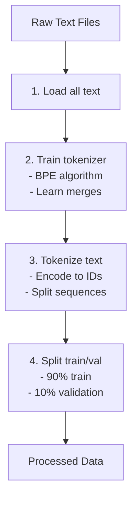
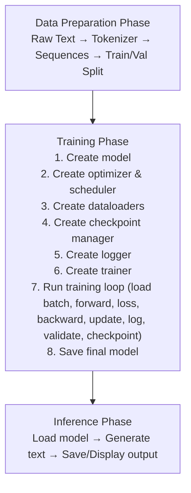

# Training Guide

This guide provides step-by-step instructions for training Athena, from data preparation to running training.

## Table of Contents
1. [Prerequisites](#prerequisites)
2. [Data Preparation](#data-preparation)
3. [Quick Test Training](#quick-test-training)
4. [Full Training](#full-training)
5. [Monitoring Training](#monitoring-training)
6. [Troubleshooting](#troubleshooting)

---

## Prerequisites

### Hardware Requirements

**Minimum Requirements:**
- CPU: Any modern multi-core processor
- RAM: 8GB
- GPU: Not required (slow training)

**Recommended Requirements:**
- GPU: NVIDIA RTX 4050 or better
- VRAM: 6GB+
- RAM: 16GB
- Storage: 10GB free space

### Software Requirements

**Required:**
- Python: 3.10+ (3.11+ recommended)
- PyTorch: 2.0+

Installation:
```bash
pip install -r requirements.txt
```

### Compute Backends

Athena is vendor-agnostic. `get_device()` auto-detects the fastest available
accelerator; `train.py` and `generate.py` also accept `--backend`
(`auto`/`cuda`/`xpu`/`mps`/`directml`/`cpu`). CPU works out of the box; a GPU
needs a matching PyTorch wheel.

- **What to install for each backend:** see the
  [Compute Backends table in the README](../README.md#devices--gpu-vendors-vendor-agnostic).
- **PyTorch install picker:** https://pytorch.org/get-started/locally/
- Run `python -m src.utils.device` to print detected devices and the exact
  install command for any missing backend.

> There is no Vulkan backend — use DirectML for a vendor-agnostic GPU path on Windows.

---

## Data Preparation

### Step 1: Gather Training Text

Create a directory with your training text files:

```
data/raw/
├── book1.txt
├── book2.txt
├── articles/
│   ├── article1.txt
│   └── article2.txt
└── ...
```

**Tips for Good Training Data:**
- ✓ Diverse text sources
- ✓ Clean, well-formatted text
- ✓ At least a few million tokens
- ✗ Too much repetition
- ✗ Poor quality text

### Step 2: Prepare Data

Run the data preparation script:

```bash
python scripts/prepare_data.py \
    --data-dir data/raw/ \
    --output-dir data/processed/ \
    --vocab-size 32000
```

**Options:**
- `--vocab-size`: Vocabulary size (32000 for production, 1000-10000 for testing)
- `--max-seq-length`: Maximum sequence length (default: 512)
- `--test-run`: Use small subset for testing
- `--val-split`: Validation split fraction (default: 0.1)

**What This Does:**


> **Paper (BPE tokenization):** Sennrich et al., *Neural Machine Translation of Rare Words with Subword Units* (2015) — https://arxiv.org/abs/1508.07909

**Output Files:**
```
data/processed/
├── train_sequences.json    # Training sequences
├── val_sequences.json      # Validation sequences
├── tokenizer.json           # Trained tokenizer
└── metadata.json            # Data statistics
```

---

## Quick Test Training

### Overview

Before committing to long training, run a quick test to verify everything works.

### Step 1: Run Quick Test Suite

```bash
python scripts/quick_test.py
```

**This tests:**
- ✓ Model creation
- ✓ Forward/backward passes
- ✓ Tokenization
- ✓ Data pipeline
- ✓ Training step
- ✓ Generation

**Expected output:**
```
======================================================================
ATHENA - QUICK TEST SUITE
======================================================================

✓ TEST 1: Model Creation and Forward Pass: PASSED
✓ TEST 2: Backward Pass: PASSED
✓ TEST 3: Tokenizer: PASSED
✓ TEST 4: Data Preparation: PASSED
✓ TEST 5: Training Step: PASSED
✓ TEST 6: Text Generation: PASSED

Results: 6/6 tests passed

🎉 All tests passed! Your LLM implementation is working correctly.
```

### Step 2: Tiny Test Run

Train pico model for 100 steps:

```bash
python scripts/train.py \
    --config pico \
    --data-dir data/processed/ \
    --steps 100 \
    --log-every 10 \
    --checkpoint-every 50
```

**Expected:**
- Completes in ~2-5 minutes (GPU) or ~10-20 minutes (CPU)
- Loss should decrease
- Checkpoint saved every 50 steps

**What to Check:**
- Loss decreases smoothly (not erratic)
- No NaN or Inf values
- Checkpoints save successfully
- Logs show progress

---

## Full Training

### Training Command

```bash
python scripts/train.py \
    --config small \
    --data-dir data/processed/ \
    --steps 50000 \
    --batch-size 32 \
    --gradient-accumulation 4 \
    --learning-rate 1e-3 \
    --warmup-steps 1000
```

### Recommended Configurations

#### For Quick Experimentation (micro: 6M parameters)

```bash
python scripts/train.py \
    --config micro \
    --data-dir data/processed/ \
    --steps 20000 \
    --log-every 100 \
    --validation-every 1000 \
    --checkpoint-every 5000
```

**Time:** ~10 minutes per epoch (RTX 4050)

#### For Production Use (small: 25M parameters)

```bash
python scripts/train.py \
    --config small \
    --data-dir data/processed/ \
    --steps 50000 \
    --log-every 100 \
    --validation-every 1000 \
    --checkpoint-every 5000
```

**Time:** ~40 minutes per epoch (RTX 4050)

#### For Maximum Quality (medium: 50M parameters)

```bash
python scripts/train.py \
    --config medium \
    --data-dir data/processed/ \
    --steps 100000 \
    --batch-size 16 \
    --gradient-accumulation 8 \
    --log-every 100 \
    --validation-every 1000 \
    --checkpoint-every 5000
```

**Time:** ~70 minutes per epoch (RTX 4050)

### Command-Line Options

```
Model Configuration:
  --config {pico,nano,micro,tiny,small,medium,large}
  --vocab-size N          Vocabulary size

Data:
  --data-dir PATH        Processed data directory
  --train-file FILE      Training sequences file
  --val-file FILE        Validation sequences file

Training Settings:
  --steps N              Maximum training steps
  --epochs N             Maximum training epochs
  --batch-size N         Batch size
  --gradient-accumulation N  Gradient accumulation steps
  --learning-rate F       Learning rate
  --warmup-steps N       Warmup steps
  --weight-decay F       Weight decay
  --max-gradient-norm F   Max gradient norm for clipping

Precision:
  --no-fp16              Disable FP16 (use FP32)

Logging:
  --log-dir PATH         Log directory
  --log-every N          Log every N steps
  --validation-every N  Validate every N steps

Checkpointing:
  --checkpoint-dir PATH  Checkpoint directory
  --checkpoint-every N   Save checkpoint every N steps
  --save-total-limit N  Keep only last N checkpoints

Resumption:
  --resume PATH          Resume from checkpoint

Misc:
  --seed N               Random seed
  --device {cuda,cpu}    Device to use
```

> **Papers (optimizer and schedule):**
> - Loshchilov & Hutter, *Decoupled Weight Decay Regularization (AdamW)* (2019) — https://arxiv.org/abs/1711.05101
> - Loshchilov & Hutter, *SGDR: Stochastic Gradient Descent with Warm Restarts* (2016) — https://arxiv.org/abs/1608.03983
>
> **Paper (mixed-precision / FP16):** Micikevicius et al., *Mixed Precision Training* (2018) — https://arxiv.org/abs/1710.03740

---

## Monitoring Training

### TensorBoard

Start TensorBoard to monitor training:

```bash
tensorboard --logdir logs
```

Open browser: `http://localhost:6006`

**Metrics to Watch:**
- Loss/train: Should decrease smoothly
- Loss/validation: Should follow train but slightly higher
- LearningRate: Should follow schedule (warmup → decay)
- Gradients/norm: Should stay reasonable (0.1 - 10)
- Throughput/tokens_per_sec: Training speed

### Interpret Metrics

```
Loss:
  • Lower is better
  • Should decrease smoothly
  • Spikes = training instability
  • Not decreasing = learning rate too low or data issue

Perplexity:
  • exp(loss)
  • Lower is better
  • 10-50: Good for small models
  • 5-20: Good for large models

Gradient Norm:
  • Should stay 0.1 - 10
  • Too high: Exploding gradients
  • Too low: Vanishing gradients

Throughput:
  • Higher is better
  • GPU: 10,000 - 100,000 tokens/sec
  • CPU: 1,000 - 10,000 tokens/sec
```

### Training Progress Checklist

**Step 0–100 (Warmup):**
- Loss: May fluctuate (normal)
- Learning rate: Increasing to peak
- Check: Not stuck at high loss

**Step 100–1,000 (Initial training):**
- Loss: Decreasing rapidly
- Learning rate: Peak LR
- Check: Smooth decrease

**Step 1,000–End (Main training):**
- Loss: Gradual decrease
- Learning rate: Decaying (cosine)
- Check: Converging to stable value

**Signs of Problems:**
- ✗ Loss goes up (LR too high)
- ✗ Loss fluctuates wildly (data issue or LR too high)
- ✗ Loss plateaus (LR too low or data exhausted)
- ✗ Gradient norm spikes (exploding gradients)

---

## Troubleshooting

### Common Issues

#### 1. Out of Memory

**Symptoms:**
```
RuntimeError: CUDA out of memory
```

**Solutions:**
```bash
# Reduce batch size
--batch-size 16  # instead of 32

# Increase gradient accumulation
--gradient-accumulation 8  # instead of 4

# Use smaller model
--config tiny  # instead of small

# Reduce sequence length
# (Requires reprocessing data with --max-seq-length)
```

#### 2. Loss is NaN or Inf

**Symptoms:**
```
Loss: nan
Gradient Norm: nan
```

**Solutions:**
```bash
# Reduce learning rate
--learning-rate 5e-4  # instead of 1e-3

# Enable gradient clipping
--max-gradient-norm 1.0

# Increase warmup
--warmup-steps 2000  # instead of 1000

# Check data quality
# Look for corrupted sequences or empty files
```

#### 3. Training Too Slow

**Symptoms:**
- Very low tokens/sec throughput
- Training takes much longer than expected

**Solutions:**
```bash
# Enable FP16 (default)
# Already enabled by default

# Increase batch size
--batch-size 64  # if memory allows

# Reduce logging frequency
--log-every 200  # instead of 100

# Disable validation during training
--no-validation
```

#### 4. Loss Not Decreasing

**Symptoms:**
- Loss stays constant or increases
- Model not learning

**Solutions:**
```bash
# Check learning rate
--learning-rate 1e-3  # might be too low or high

# Increase warmup
--warmup-steps 2000

# Check data
# Ensure training data is loaded correctly

# Reduce weight decay
--weight-decay 0.01  # instead of 0.1
```

#### 5. Poor Generation Quality

**Symptoms:**
- Generated text is gibberish
- Repetitive output
- Incoherent text

**Solutions:**
```bash
# Train longer
--steps 100000  # instead of 50000

# Use larger model
--config medium  # instead of small

# Adjust sampling parameters (for inference)
--temperature 0.8  # for generation
--top-p 0.9

# More training data
# Add more diverse text to training data
```

---

## Training Tips

### Best Practices

1. **Start Small:**
   - Test with pico/nano model first
   - Verify data pipeline works
   - Check training loop is stable

2. **Monitor Metrics:**
   - Use TensorBoard for visualization
   - Check logs regularly
   - Save checkpoints frequently

3. **Validate Regularly:**
   - Run validation every 1K-5K steps
   - Monitor validation loss
   - Check for overfitting

4. **Save Checkpoints:**
   - Save every 5K-10K steps
   - Keep last 3 checkpoints
   - Save best model separately

5. **Hardware:**
   - Use GPU if available
   - Enable FP16 for speed
   - Monitor GPU temperature

### Training Flow Diagram



---

## Summary

### Quick Start Checklist

- [ ] Prepare training data in `data/raw/`
- [ ] Run `scripts/prepare_data.py`
- [ ] Run `scripts/quick_test.py`
- [ ] Run test training with `--config pico --steps 100`
- [ ] Run full training with desired config
- [ ] Monitor with TensorBoard
- [ ] Evaluate generation quality

### Next Steps

After training:
- [ ] Test generation quality
- [ ] Compare different model sizes
- [ ] Experiment with hyperparameters
- [ ] Try different sampling strategies
- [ ] Use [Inference Guide](inference_guide.md) for generation

---

**For more details:**
- [Architecture Documentation](architecture.md) - Detailed architecture explanation
- [Inference Guide](inference_guide.md) - How to use trained model

---

## References

See the full annotated list in [README.md — References](../README.md#references).
Key papers for training:

- Sennrich et al., *Neural Machine Translation of Rare Words with Subword Units* (BPE, 2015) — https://arxiv.org/abs/1508.07909
- Loshchilov & Hutter, *Decoupled Weight Decay Regularization* (AdamW, 2019) — https://arxiv.org/abs/1711.05101
- Loshchilov & Hutter, *SGDR: Stochastic Gradient Descent with Warm Restarts* (cosine LR, 2016) — https://arxiv.org/abs/1608.03983
- Micikevicius et al., *Mixed Precision Training* (FP16, 2018) — https://arxiv.org/abs/1710.03740
